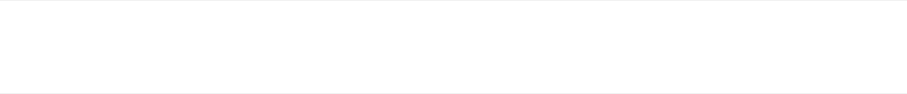
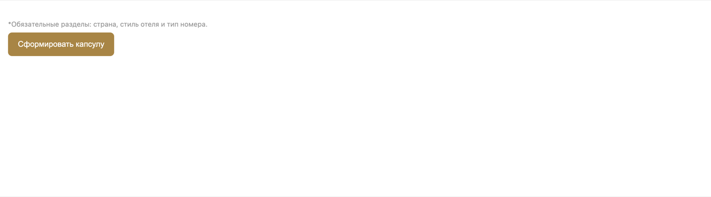
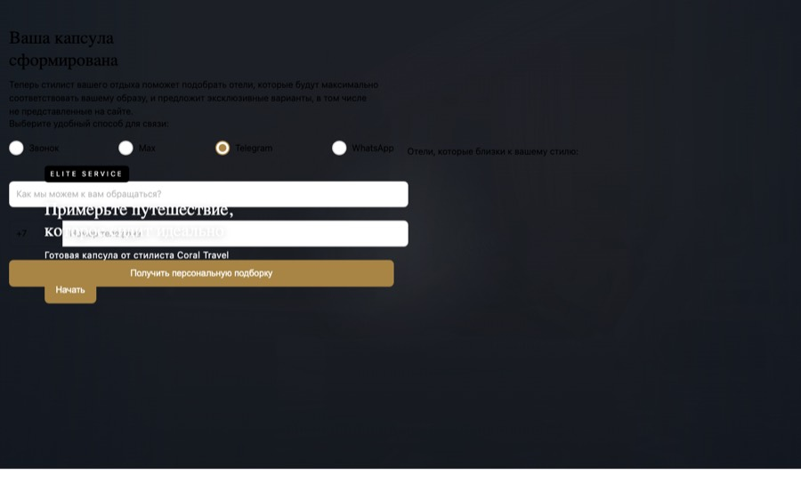
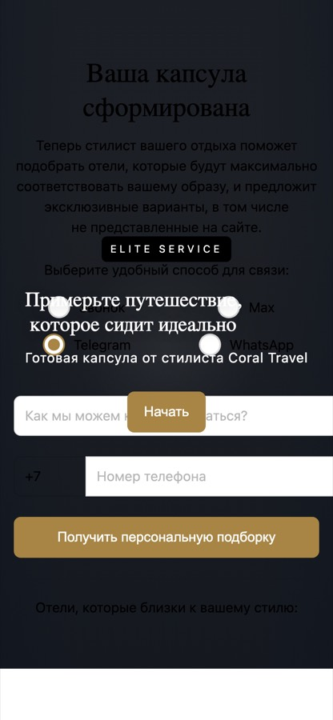
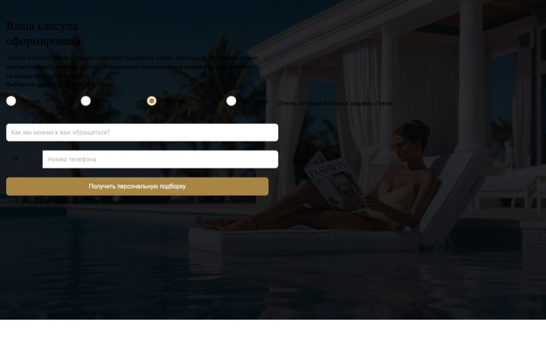
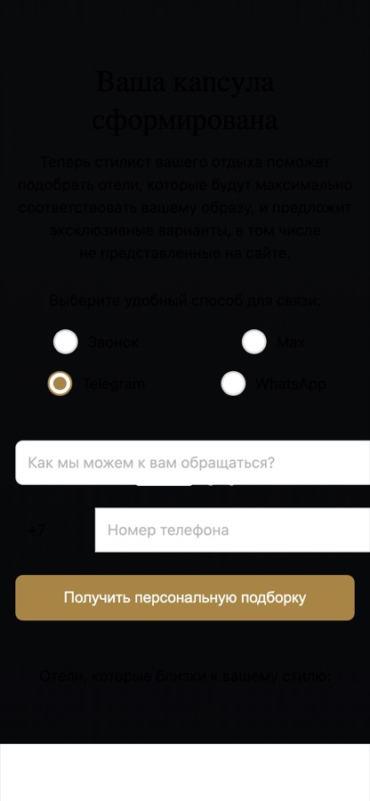
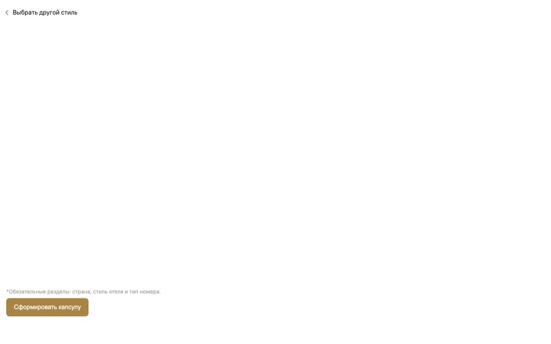
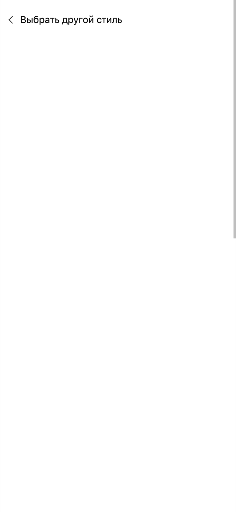

# Визуальный аудит лендинга Kapsula

Дата: 2026-08-07 · Коммит: `1130d66` (после Этапа 3) · Правки **не вносились**

---

## Как проводилось тестирование

К обычной вкладке Chrome подключиться не удалось: **начиная с Chrome 136 Google запретил
подключение по CDP к основному профилю пользователя** (защита от кражи cookie через отладочный порт).
Флаг `--remote-debugging-port` на профиле `Default` молча игнорируется — порт не открывается,
файл `DevToolsActivePort` не создаётся. Установленная версия — Chrome 151.

Поэтому тестирование шло так:

1. Собранный CMS-блок `@CMS/kapsula.html` (он самодостаточен — стили, разметка и JS инлайнятся
   в один файл) обёрнут в минимальную HTML-страницу с CSS-переменными хоста
   (`--site-header-mobile-height`, `--kapsula-header-height`, `.layout-container-limit`).
2. Страница открыта в headless-Chrome на **изолированном профиле** (`--user-data-dir=/tmp/...`) —
   там ограничение не действует. Основной браузер не затрагивался.
3. Через CDP снимались метрики: `scrollWidth/clientWidth`, `scrollHeight/innerHeight`,
   `getBoundingClientRect()` каждого элемента активного экрана, вычисленные
   `grid-template-columns` и фактические ширины карточек.
4. Матрица: 4 экрана (hero / steps / styles / form) × 5 ширин (360, 390, 768, 1024, 1440)
   плюс отдельный прогон сетки на 1024 / 1100 / 1200 / 1280 / 1440 / 1600.

JS отработал полностью: форма рендерится скриптом, и в замерах видны все 7 секций с сетками —
значит `renderForm` и остальная логика выполнились, замеры сделаны по «живому» DOM.

**Ограничение метода:** headless не воспроизводит сворачивание адресной строки мобильного браузера,
поэтому проблема №3 ниже остаётся гипотезой и требует проверки на реальном телефоне.

---

## Итог

| # | Проблема | Серьёзность | Статус |
|---|----------|-------------|--------|
| 1 | Заголовок секции вылезает за пределы кнопки из-за `scale(1.08)` | заметная | подтверждено замерами |
| 2 | Неравные колонки сетки на 1024px (147/142/143px) | средняя | подтверждено замерами |
| 3 | `100vh` без `dvh` на steps/form | потенциальная | требует проверки на устройстве |
| — | Горизонтальный скролл | — | **не обнаружен ни на одной ширине** |
| — | Вертикальный скролл на steps/form | — | **штатный**, контента больше экрана |

---

## Проблема 1. Заголовок секции выходит за пределы кнопки

**Где:** `src/scripts/kapsula/features/form/effects/animateFormSections.js` — `scale: 1.08` для
`.kapsula-form-section__heading` у развёрнутой секции.

**Суть.** Заголовок увеличивается трансформом, но `transform` не влияет на раскладку: браузер
резервирует место по исходному размеру. В результате визуально текст выходит за правую границу
кнопки-триггера. У родителя `overflow: visible`, поэтому обрезки нет — текст наезжает на область справа.

**Замер на 1440px** (прямое сравнение с временно снятым трансформом):

```
transform: matrix(1.08, 0, 0, 1.08, 0, 0)
ширина со scale : 850px  → выход за родителя  +34px
ширина без scale: 787px  → запас              −29px
overflow родителя: visible
```

Выход растёт вместе с шириной экрана, потому что `scale` умножает и без того более широкий блок:

| Ширина окна | Выход за родителя |
|-------------|-------------------|
| 1024px | +7px |
| 1100px | +10px |
| 1200px | +15px |
| 1280px | +21px |
| 1440px | +34px |
| 1600px | +37px |



*Красная рамка — фактические границы заголовка со `scale`, синий пунктир — границы кнопки-родителя.*


**Возможные решения** (на выбор, править не стал):
- заменить `scale` на анимацию `font-size` — тогда размер учтётся в раскладке;
- оставить `scale`, но заложить компенсацию: `padding-right` у кнопки или `max-width: calc(100% / 1.08)`
  для заголовка;
- отказаться от увеличения в пользу смены насыщенности/цвета.

---

## Проблема 2. Неравные колонки сетки на 1024px

**Где:** `src/styles/kapsula/shared/_card-grid.scss:38` — `grid-template-columns: repeat(3, 1fr)`.

**Суть.** `1fr` эквивалентен `minmax(auto, 1fr)`, а `auto` не даёт колонке сжаться меньше
минимального размера содержимого. Длинные подписи вроде «Почувствовать ритм города» распирают
свою колонку за счёт соседних — сетка перестаёт быть равномерной.

Это единственное место в проекте, где `minmax(0, ...)` пропущен: в `_card-grid.scss:10`
и `_styles-screen.scss:31` он есть.

**Замер, секция «Впечатления» (4 карточки):**

```
1024px → 147.05 / 142.41 / 142.55 / 147.05 px   ← расхождение до 4.6px
1100px → 156.66 / 156.67 / 156.67 / 156.66 px   ← ok
1200px → 176 / 176 / 176 / 176 px               ← ok
1440px → 256 / 256 / 256 / 256 px               ← ok
```

Проявляется только на узком десктопе (~1024px), где ширины колонки едва хватает под текст.


*Подписи показывают фактическую ширину каждой карточки. Видно расхождение 147 / 142 / 143 / 147.*



**Решение:** заменить на `repeat(3, minmax(0, 1fr))` — приводит к единому виду с остальными сетками.

---

## Проблема 3. `100vh` без `dvh`-фолбэка (гипотеза)

**Где:** `src/styles/kapsula/features/navigation/_steps.scss:42` и `src/styles/kapsula/features/form/_form-screen.scss:27`.

```scss
min-height: calc(100vh - var(--site-header-mobile-height));
```

В `_hero.scss` тот же приём реализован правильно — с дублирующей строкой на `100dvh`
(строки 5-6, 13-14, 107-112), а в этих двух файлах фолбэка нет.

На мобильных браузерах `100vh` считается по «большому» вьюпорту — с учётом высоты свёрнутой
адресной строки. Пока она развёрнута, блок оказывается выше видимой области и появляется
лишний скролл на ~60-100px. Экраны steps и form в этом смысле ведут себя иначе, чем hero.

**Проверить не смог:** headless-Chrome не эмулирует динамическую адресную строку. Нужен реальный телефон.

---

## Что проверено и оказалось нормой

**Горизонтального скролла нет** ни на одной из пяти ширин: `scrollWidth - innerWidth = 0` везде.

**Элементы «за экраном» на styles и form — это слайды каруселей Embla.** Детектор их отметил,
но у контейнера `overflow: hidden` и включён скролл-снап, то есть поведение штатное:

```
[styles] grid kapsula-card-grid  flex  cols=2 kids=3 rows=2  SCROLL-X
```

**Вертикальный скролл на steps и form — штатный.** Контента объективно больше экрана,
на 390×844 форма занимает 1643px. Это не дефект вёрстки.

```
[hero]  v: ok          doc 390x844
[steps] v: +641px      doc 390x1485
[form]  v: +799px      doc 390x1643
```

---

## Общие виды экранов

Сняты для контекста, дефектов на них не обнаружено.

| Десктоп (1440×900) | Мобильный (390×844) |
|--------------------|---------------------|
|  |  |
|  |  |
|  |  |
|  |  |

*Фотографичные кадры пережаты в JPEG, скриншоты с разметкой оставлены в PNG ради читаемости
подписей. Общий вес папки — 488 КБ вместо исходных 2.4 МБ.*

---

## Как воспроизвести

```bash
# 1. собрать блок
node src/lib/build-cms.mjs

# 2. поднять headless-Chrome на отдельном профиле
"/Applications/Google Chrome.app/Contents/MacOS/Google Chrome" \
  --headless=new --disable-gpu \
  --remote-debugging-port=9333 \
  "--remote-allow-origins=http://127.0.0.1:9333" \
  --user-data-dir=/tmp/chrome-cdp-profile \
  --no-first-run "file:///путь/к/тестовой/странице.html" &
```

Далее подключение по WebSocket из `http://127.0.0.1:9333/json/list` и вызовы
`Emulation.setDeviceMetricsOverride` + `Runtime.evaluate` с замерами.

Нюансы, на которые я напоролся:
- флаг `--remote-allow-origins` обязателен, иначе WebSocket-рукопожатие отдаёт `403 Forbidden`;
- в zsh значение флага нужно брать в кавычки, иначе `*` раскроется как глоб;
- системный Python в macOS защищён (PEP 668) — `websocket-client` ставится только в venv.
